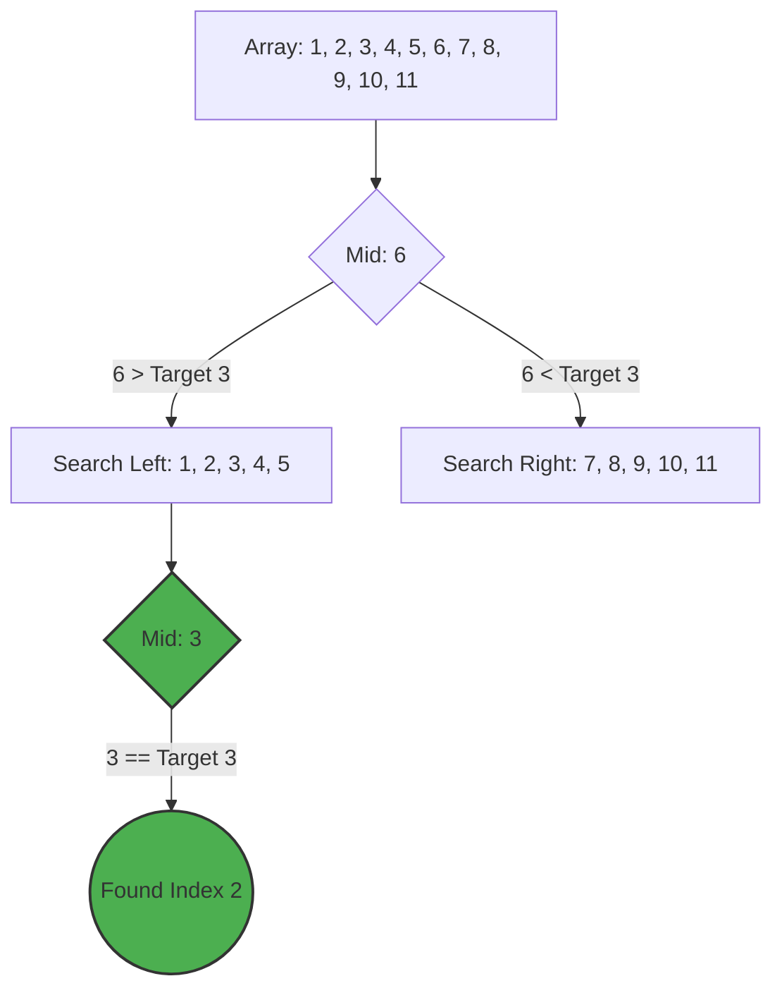

# 🎯 Binary Search Guide

Binary Search is a highly efficient algorithm for finding an item from a **sorted** list of items. It works by repeatedly dividing in half the portion of the list that could contain the item, until you've narrowed down the possible locations to just one.

## 🚀 How it Works
1. Start with the entire array.
2. Find the middle element.
3. If the middle element is the target, return the index.
4. If the target is less than the middle element, repeat the search on the left half.
5. If the target is greater than the middle element, repeat the search on the right half.
6. Continue until the target is found or the search space is empty.

## 📊 Visual Representation



## ⏱️ Complexity Analysis

| Case | Complexity |
| :--- | :--- |
| **Best Case** | O(1) (Target is exactly at the middle) |
| **Average Case** | O(log n) |
| **Worst Case** | O(log n) |
| **Space Complexity** | O(1) (Iterative implementation) |

## 💻 Implementation Snippet

```javascript
function binarySearch(arr, target) {
    let left = 0;
    let right = arr.length - 1;

    while (left <= right) {
        let m = Math.floor((left + right) / 2);
        if (arr[m] === target) {
            return m;
        } else if (arr[m] < target) {
            left = m + 1;
        } else {
            right = m - 1;
        }
    }
    return -1;
}
```

---
> [!IMPORTANT]
> Binary Search ONLY works on **Sorted** arrays.

---
[⬅️ Back to Main README](README.md)
