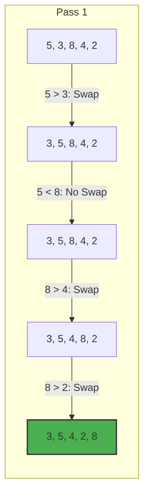

# 🫧 Bubble Sort Guide

Bubble Sort is a simple comparison-based algorithm that repeatedly steps through the list, compares adjacent elements, and swaps them if they are in the wrong order. The pass through the list is repeated until the list is sorted.

## 🚀 How it Works
1. Compare the first two elements.
2. If the first is greater than the second, swap them.
3. Move to the next pair and repeat until the end of the array (the largest element "bubbles" to the top).
4. Repeat the process for the remaining elements.

## 📊 Visual Representation



## ⏱️ Complexity Analysis

| Case | Complexity |
| :--- | :--- |
| **Best Case** | O(n) (Already sorted, with optimization) |
| **Average Case** | O(n²) |
| **Worst Case** | O(n²) |
| **Space Complexity** | O(1) (In-place sorting) |

## 💻 Implementation Snippet

```javascript
function bubbleSortOptimized(arr) {
  let n = arr.length;
  let swapped;

  for (let i = 0; i < n - 1; i++) {
    swapped = false;
    for (let j = 0; j < n - i - 1; j++) {
      if (arr[j] > arr[j + 1]) {
        [arr[j], arr[j + 1]] = [arr[j + 1], arr[j]];
        swapped = true;
      }
    }
    if (!swapped) break;
  }
  return arr;
}
```

---
[⬅️ Back to Main README](README.md)
