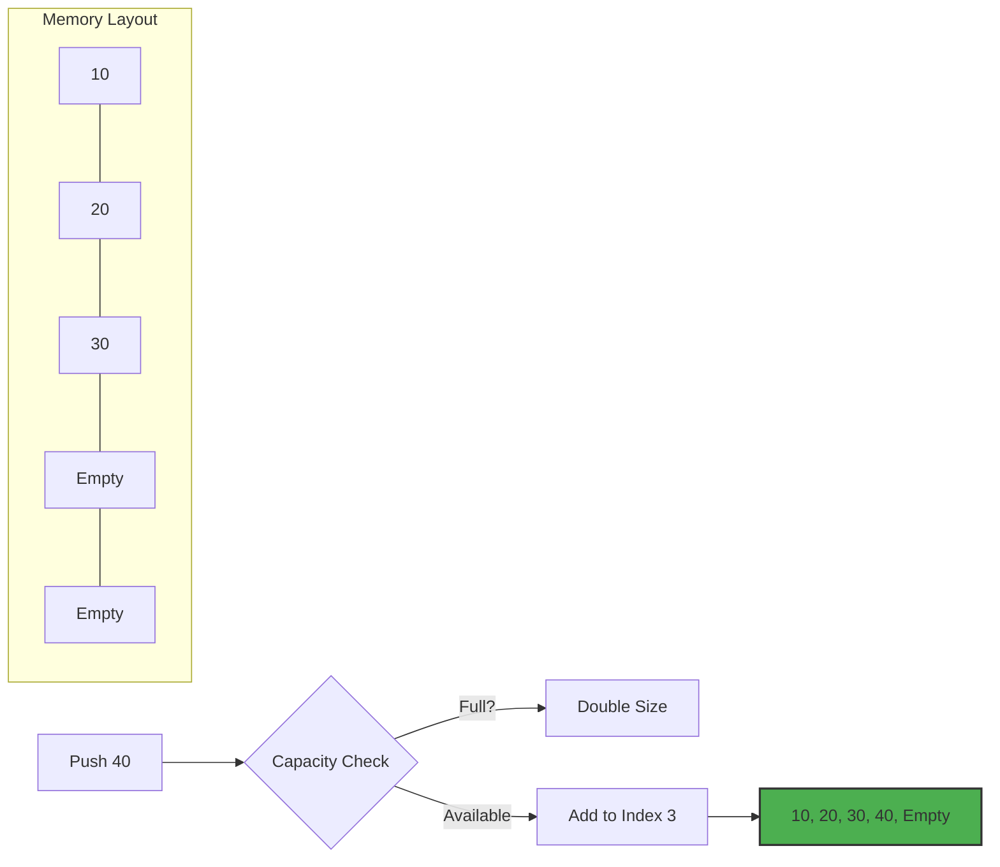

# 📏 Dynamic Array Guide

A Dynamic Array is a random-access, variable-size list data structure that allows elements to be added or removed. In JavaScript, the built-in `Array` is dynamic by default.

## 🚀 How it Works
1. **Initial Capacity**: The array starts with a certain capacity.
2. **Growth**: When the array is full, it automatically resizes (usually doubling its size) to accommodate new elements.
3. **Random Access**: Elements can be accessed instantly using their index.

## 📊 Visual Representation



## ⏱️ Complexity Analysis

| Operation | Complexity |
| :--- | :--- |
| **Access** | O(1) |
| **Search** | O(n) |
| **Insertion (End)** | Amortized O(1) |
| **Deletion (End)** | O(1) |
| **Insertion (Middle)** | O(n) |

## 💻 Implementation Snippet

```javascript
let arr = []; // JavaScript arrays are dynamic

arr.push(10); // O(1)
arr.push(20);
arr.pop();    // O(1)
```

---
[⬅️ Back to Main README](README.md)
