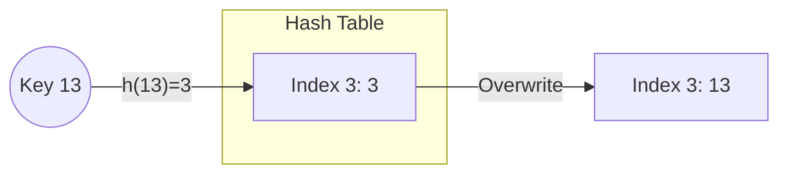
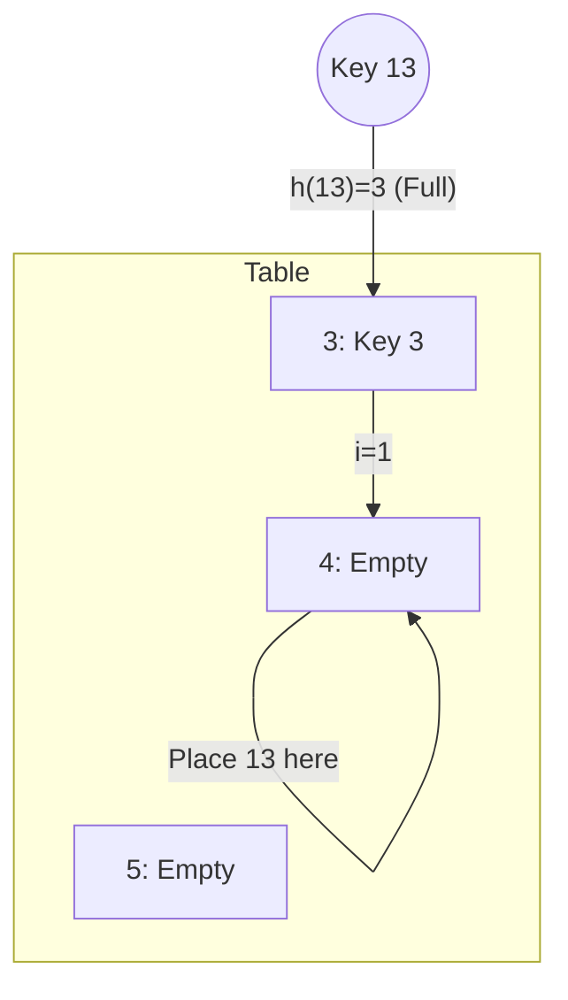
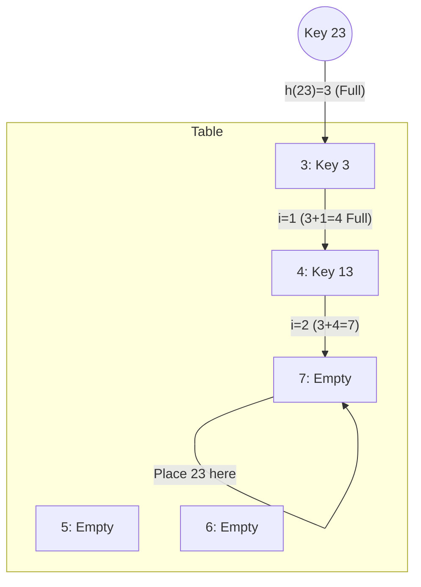
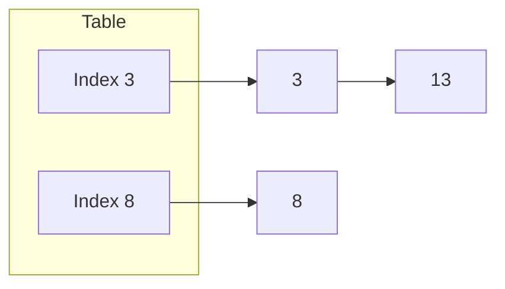

# 🛡️ Hashing and Collision Resolution

Hashing is the process of mapping data of arbitrary size to fixed-size values (hash codes) using a **Hash Function**.

## 🔑 The Hash Function
In our implementations, we use the **Modulo Operator**:
`index = h(Key) = Key % Size`

---

## ⚠️ Collisions
A collision occurs when two different keys produce the same hash index. 
**Example:** `h(3) = 3 % 10 = 3` and `h(13) = 13 % 10 = 3`. Both want to sit at index **3**.

---

## 🛠️ Collision Resolution Methods

### 1. Replacement
The simplest (but destructive) method. The new value simply overwrites the old value at that index.

---

### 2. Open Addressing
When a collision occurs, we look for another empty slot in the table.

#### A. Linear Probing
We search for the next available slot sequentially.
**Formula:** `index = (h(Key) + i) % Size`

#### B. Quadratic Probing
We "jump" using a quadratic function to reduce clustering.
**Formula:** `index = (h(Key) + i²) % Size`

---

### 3. Chaining (Open Hashing)
Instead of finding a new slot, each slot in the table holds a list (or bucket). Multiple keys can coexist at the same index.

---

## 🚀 Complexity Analysis

| Method | Best Case | Worst Case (Full/Clustered) |
| :--- | :--- | :--- |
| **Search** | O(1) | O(n) |
| **Insertion** | O(1) | O(n) |
| **Deletion** | O(1) | O(n) |

---

## 👨‍💻 Author
**Ahmed GH Tarek**  
[GitHub Profile](https://github.com/ahmedGHtarek0)
