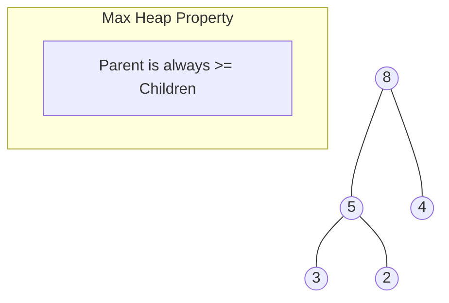

# 🏔️ Heap Sort Guide

Heap Sort is a comparison-based sorting technique based on a Binary Heap data structure. It is similar to selection sort where we first find the maximum element and place the maximum element at the end. We repeat the same process for the remaining elements.

## 🚀 How it Works
1. **Build Heap**: Transform the array into a Max Heap (for ascending order).
2. **Extract**: Swap the root (largest) with the last element.
3. **Heapify**: Reduce heap size and heapify the root to restore Max Heap property.
4. **Repeat**: Continue until the heap size is 1.

## 📊 Visual Representation



## ⏱️ Complexity Analysis

| Case | Complexity |
| :--- | :--- |
| **Best Case** | O(n log n) |
| **Average Case** | O(n log n) |
| **Worst Case** | O(n log n) |
| **Space Complexity** | O(1) (In-place) |

## 💻 Implementation Snippet

```javascript
function maxHeapify(arr, n, i) {
  let largest = i;
  let left = 2 * i + 1;
  let right = 2 * i + 2;

  if (left < n && arr[left] > arr[largest]) largest = left;
  if (right < n && arr[right] > arr[largest]) largest = right;

  if (largest !== i) {
    [arr[i], arr[largest]] = [arr[largest], arr[i]];
    maxHeapify(arr, n, largest);
  }
}
```

---
[⬅️ Back to Main README](README.md)
