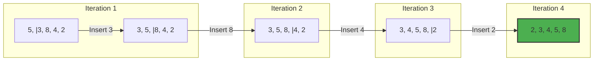

# 🃏 Insertion Sort Guide

Insertion Sort is a simple sorting algorithm that builds the final sorted array one item at a time. It is much less efficient on large lists than more advanced algorithms such as quicksort, heapsort, or merge sort.

## 🚀 How it Works
1. Assume the first element is already sorted.
2. Pick the next element and compare it with the sorted part.
3. Shift all elements in the sorted part that are larger than the picked element to the right.
4. Insert the picked element into its correct position.
5. Repeat until the array is fully sorted.

## 📊 Visual Representation



## ⏱️ Complexity Analysis

| Case | Complexity |
| :--- | :--- |
| **Best Case** | O(n) (Already sorted) |
| **Average Case** | O(n²) |
| **Worst Case** | O(n²) |
| **Space Complexity** | O(1) (In-place sorting) |

## 💻 Implementation Snippet

```javascript
function insertionSort(arr) {
  for (let i = 1; i < arr.length; i++) {
    let key = arr[i];
    let j = i - 1;
    while (j >= 0 && arr[j] > key) {
      arr[j + 1] = arr[j];
      j--;
    }
    arr[j + 1] = key;
  }
  return arr;
}
```

---
[⬅️ Back to Main README](README.md)
