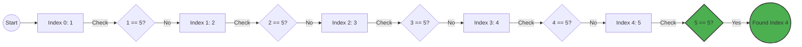

# 🔍 Linear Search Guide

Linear Search is the simplest search algorithm. It transitions through the collection sequentially, checking each element until a match is found or the end of the collection is reached.

## 🚀 How it Works
1. Start from the leftmost element of the array.
2. Compare the target value with each element.
3. If the target matches an element, return the index.
4. If the target is not found after checking all elements, return `-1`.

## 📊 Visual Representation



## ⏱️ Complexity Analysis

| Case | Complexity |
| :--- | :--- |
| **Best Case** | O(1) (Target is at the first position) |
| **Average Case** | O(n) |
| **Worst Case** | O(n) (Target is at the last position or not present) |
| **Space Complexity** | O(1) (No extra space used) |

## 💻 Implementation Snippet

```javascript
function linearSearch(arr, target) {
    for (let i = 0; i < arr.length; i++) {
        if (arr[i] === target) {
            return i;
        }
    }
    return -1;
}
```

---
[⬅️ Back to Main README](README.md)
