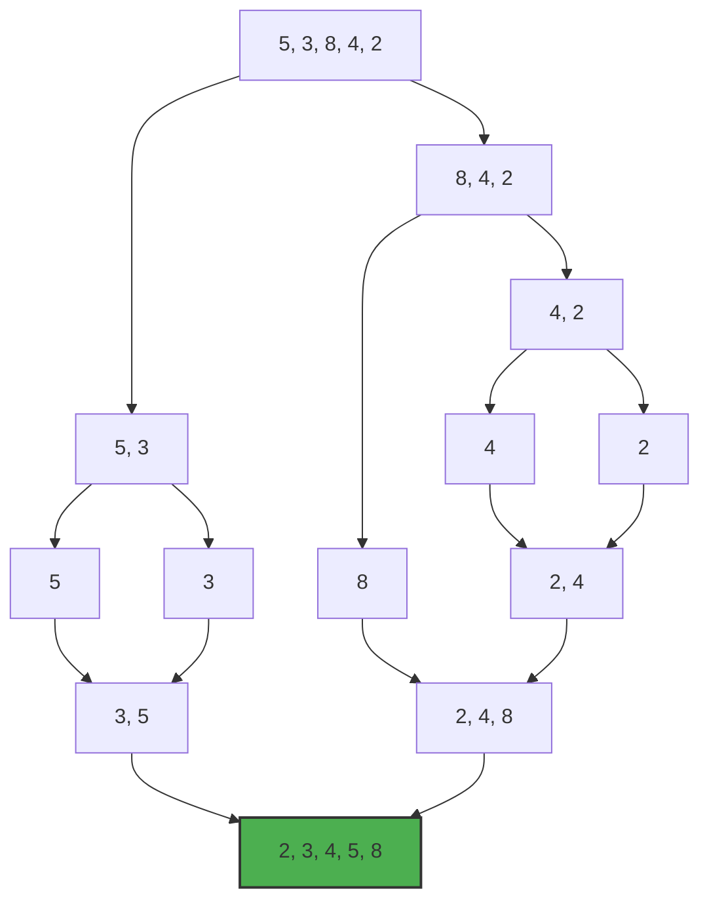

# 🧩 Merge Sort Guide

Merge Sort is an efficient, stable, and comparison-based sorting algorithm. Most implementations produce a stable sort, meaning that the implementation preserves the input order of equal elements in the sorted output. Merge Sort is a **Divide and Conquer** algorithm.

## 🚀 How it Works
1. **Divide**: Divide the unsorted list into $n$ sublists, each containing one element.
2. **Conquer**: Repeatedly merge sublists to produce new sorted sublists until there is only one sublist remaining.

## 📊 Visual Representation



## ⏱️ Complexity Analysis

| Case | Complexity |
| :--- | :--- |
| **Best Case** | O(n log n) |
| **Average Case** | O(n log n) |
| **Worst Case** | O(n log n) |
| **Space Complexity** | O(n) |

## 💻 Implementation Snippet

```javascript
function mergeSort(arr) {
  if (arr.length <= 1) return arr;

  const mid = Math.floor(arr.length / 2);
  const left = mergeSort(arr.slice(0, mid));
  const right = mergeSort(arr.slice(mid));

  return merge(left, right);
}

function merge(left, right) {
  let result = [], i = 0, j = 0;
  while (i < left.length && j < right.length) {
    if (left[i] < right[j]) result.push(left[i++]);
    else result.push(right[j++]);
  }
  return result.concat(left.slice(i)).concat(right.slice(j));
}
```

---
[⬅️ Back to Main README](README.md)
