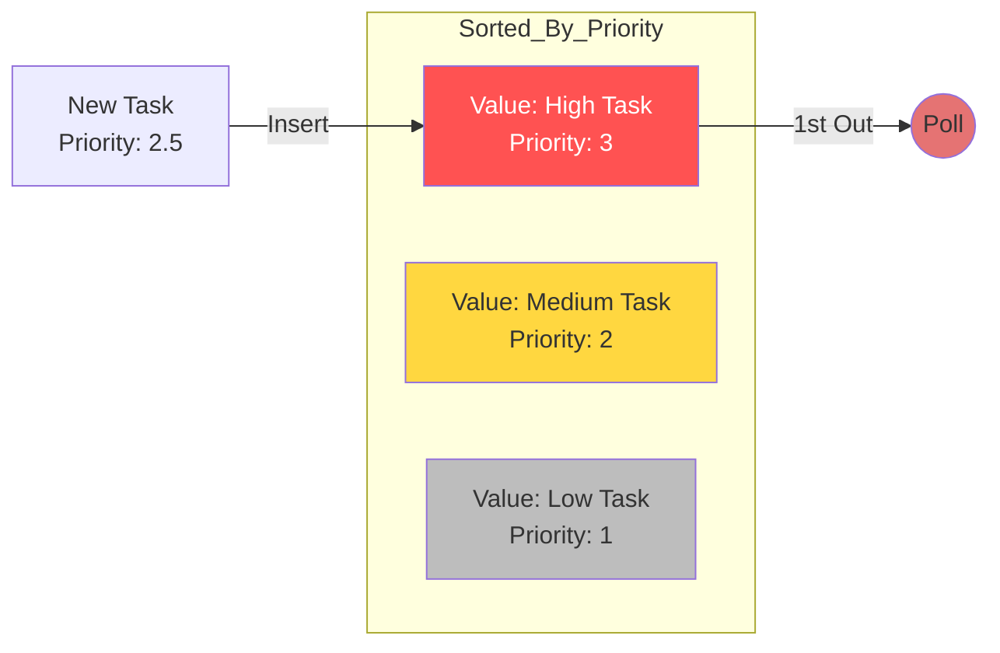

# 👑 Priority Queue Data Structure

A **Priority Queue** is a special type of queue where each element is associated with a **priority**. Elements with higher priority are served before elements with lower priority.

## ⚙️ How it Works

Unlike a standard queue, elements are inserted based on their priority level.

### Visual Representation



## 🚀 Operations

| Method | Description | Complexity |
| :--- | :--- | :--- |
| `enqueue(val, priority)` | Inserts element in sorted order. | O(n) |
| `poll()` | Removes and returns highest priority element. | O(1) |
| `peek()` | Returns highest priority element. | O(1) |

## 💻 Implementation Snippet

```javascript
enqueue(value, priority) {
  const element = { value, priority };
  let added = false;

  for (let i = 0; i < this.items.length; i++) {
    if (element.priority > this.items[i].priority) {
      this.items.splice(i, 0, element);
      added = true;
      break;
    }
  }

  if (!added) this.items.push(element);
}
```

[⬅️ Back to README](README.md)
