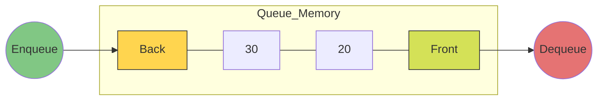

# 📋 Queue Data Structure

A **Queue** is a linear data structure that follows the **FIFO (First-In, First-Out)** principle. The first element added to the queue is the first one to be removed.

## ⚙️ How it Works

Think of a movie theater line: the person who arrives first gets their ticket first.

### Visual Representation



## 🚀 Operations

| Method | Description | Complexity |
| :--- | :--- | :--- |
| `enqueue(element)` | Adds an element to the back of the queue. | O(1) |
| `dequeue()` | Removes and returns the front element. | O(n) in this implementation (shift) |
| `front()` | Returns the front element without removing it. | O(1) |
| `isEmpty()` | Checks if the queue is empty. | O(1) |

## 💻 Implementation Snippet

```javascript
class Queue {
  constructor() {
    this.items = [];
  }

  enqueue(element) {
    this.items.push(element);
  }

  dequeue() {
    if (this.isEmpty()) return "Queue is empty";
    return this.items.shift();
  }
}
```

[⬅️ Back to README](README.md)
