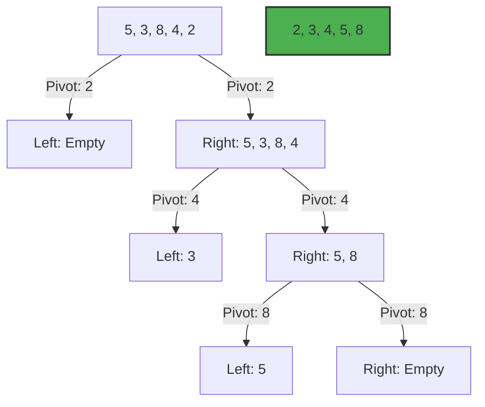

# ⚡ Quick Sort Guide

Quick Sort is a highly efficient sorting algorithm and is based on partitioning of array of data into smaller arrays. A large array is partitioned into two arrays one of which holds values smaller than the specified value, say pivot, based on which the partition is made and another array holds values greater than the pivot value.

## 🚀 How it Works
1. **Pick Pivot**: Select an element from the array (often the last element).
2. **Partition**: Reorder the array so all elements < pivot are on the left, and all > pivot are on the right.
3. **Recursion**: Recursively apply the above steps to the sub-arrays.

## 📊 Visual Representation



## ⏱️ Complexity Analysis

| Case | Complexity |
| :--- | :--- |
| **Best Case** | O(n log n) |
| **Average Case** | O(n log n) |
| **Worst Case** | O(n²) (Poor pivot choice) |
| **Space Complexity** | O(log n) (Recursive stack) |

## 💻 Implementation Snippet

```javascript
function quickSort(arr) {
  if (arr.length <= 1) return arr;
  let pivot = arr[arr.length - 1];
  let left = [], right = [];
  for (let i = 0; i < arr.length - 1; i++) {
    arr[i] < pivot ? left.push(arr[i]) : right.push(arr[i]);
  }
  return [...quickSort(left), pivot, ...quickSort(right)];
}
```

---
[⬅️ Back to Main README](README.md)
