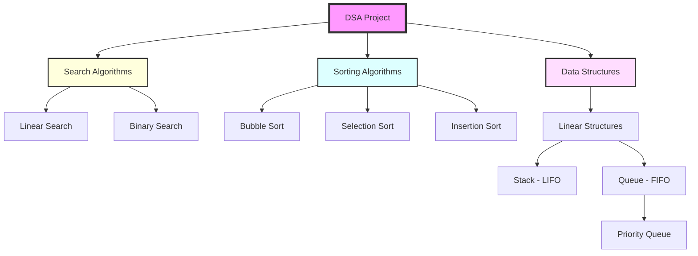

# 🚀 Data Structures in JavaScript

Welcome to the **Data Structures** repository! This project contains clean, efficient, and well-documented implementations of fundamental data structures using JavaScript.


## 📂 Project Structure

This repository provides clear implementations for the following structures:

| Data Structure / Algorithm | Description | Documentation |
| :--- | :--- | :--- |
| **Stack** | LIFO (Last-In, First-Out) implementation. | [View Guide](STACK_GUIDE.md) |
| **Queue** | FIFO (First-In, First-Out) implementation. | [View Guide](QUEUE_GUIDE.md) |
| **Priority Queue** | Element-based priority sorting implementation. | [View Guide](PRIORITY_QUEUE_GUIDE.md) |
| **Linear Search** | Sequential search through a collection. | [View Guide](LINEAR_SEARCH_GUIDE.md) |
| **Binary Search** | Efficient search for sorted collections. | [View Guide](BINARY_SEARCH_GUIDE.md) |
| **Bubble Sort** | Simple comparison-based sorting. | [View Guide](BUBBLE_SORT_GUIDE.md) |
| **Selection Sort** | Selection-based sorting algorithm. | [View Guide](SELECTION_SORT_GUIDE.md) |
| **Insertion Sort** | Efficient for small or partially sorted lists. | [View Guide](INSERTION_SORT_GUIDE.md) |

---

## 🛠️ Getting Started

To explore the implementations, simply clone the repository and run the scripts using Node.js.

### Prerequisites
- [Node.js](https://nodejs.org/) installed on your machine.

### Usage
```bash
# Run Sorting Algorithms
node BubbleSort.js
node SelectionSort.js
node InsertionSort.js

# Run Search Algorithms
node LinearSearch.js
node BinarySearch.js

# Run Data Structures
node stack.js
node queue.js
node priorityQueue.js
```

---

## 📊 Overview Diagram



---

## 👨‍💻 Author
**Ahmed GH Tarek**  
[GitHub Profile](https://github.com/ahmedGHtarek0)
