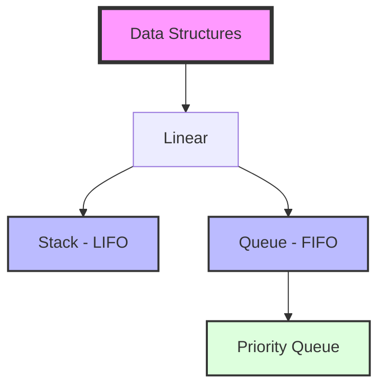

# 🚀 Data Structures in JavaScript

Welcome to the **Data Structures** repository! This project contains clean, efficient, and well-documented implementations of fundamental data structures using JavaScript.


## 📂 Project Structure

This repository provides clear implementations for the following structures:

| Data Structure | Description | Documentation |
| :--- | :--- | :--- |
| **Stack** | LIFO (Last-In, First-Out) implementation. | [View Guide](STACK_GUIDE.md) |
| **Queue** | FIFO (First-In, First-Out) implementation. | [View Guide](QUEUE_GUIDE.md) |
| **Priority Queue** | Element-based priority sorting implementation. | [View Guide](PRIORITY_QUEUE_GUIDE.md) |

---

## 🛠️ Getting Started

To explore the implementations, simply clone the repository and run the scripts using Node.js.

### Prerequisites
- [Node.js](https://nodejs.org/) installed on your machine.

### Usage
```bash
# Run Stack implementation
node stack.js

# Run Queue implementation
node queue.js

# Run Priority Queue implementation
node priorityQueue.js
```

---

## 📊 Overview Diagram



---

## 👨‍💻 Author
**Ahmed GH Tarek**  
[GitHub Profile](https://github.com/ahmedGHtarek0)
