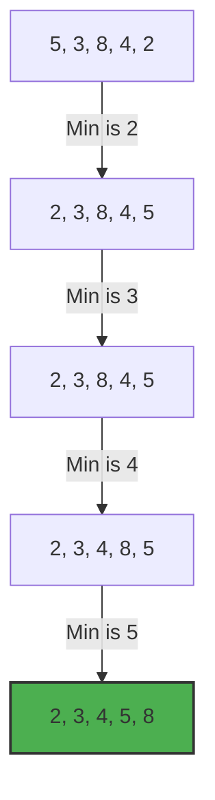

# 🎯 Selection Sort Guide

Selection Sort is an in-place comparison sorting algorithm. It divides the input list into two parts: a sorted sublist of items which is built up from left to right at the front (left) of the list, and a sublist of the remaining unsorted items that occupy the rest of the list.

## 🚀 How it Works
1. Find the smallest element in the unsorted part.
2. Swap it with the first element of the unsorted part.
3. The boundary between sorted and unsorted parts moves one element to the right.
4. Repeat until the entire array is sorted.

## 📊 Visual Representation



## ⏱️ Complexity Analysis

| Case | Complexity |
| :--- | :--- |
| **Best Case** | O(n²) |
| **Average Case** | O(n²) |
| **Worst Case** | O(n²) |
| **Space Complexity** | O(1) (In-place sorting) |

## 💻 Implementation Snippet

```javascript
function selectionSort(arr) {
  let n = arr.length;
  for (let i = 0; i < n - 1; i++) {
    let minIndex = i;
    for (let j = i + 1; j < n; j++) {
      if (arr[j] < arr[minIndex]) {
        minIndex = j;
      }
    }
    if (minIndex !== i) {
      [arr[i], arr[minIndex]] = [arr[minIndex], arr[i]];
    }
  }
  return arr;
}
```

---
[⬅️ Back to Main README](README.md)
