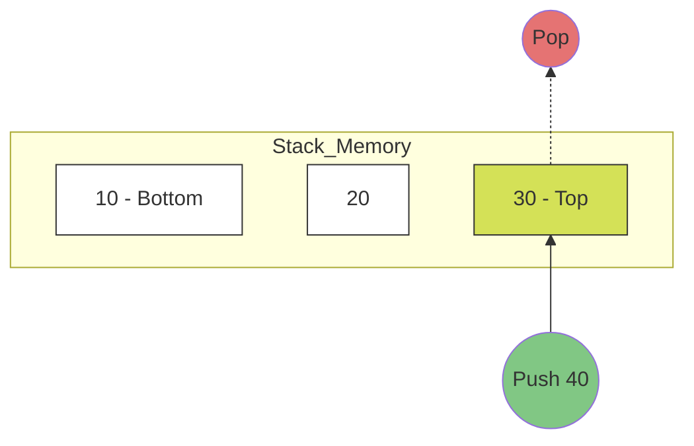

# 📚 Stack Data Structure

A **Stack** is a linear data structure that follows the **LIFO (Last-In, First-Out)** principle. The last element added to the stack is the first one to be removed.

## ⚙️ How it Works

Imagine a stack of plates: you can only add a plate to the top, and you can only take the top plate off.

### Visual Representation



## 🚀 Operations

| Method | Description | Complexity |
| :--- | :--- | :--- |
| `push(element)` | Adds an element to the top of the stack. | O(1) |
| `pop()` | Removes and returns the top element. | O(1) |
| `peek()` | Returns the top element without removing it. | O(1) |
| `isEmpty()` | Checks if the stack is empty. | O(1) |

## 💻 Implementation Snippet

```javascript
class Stack {
  constructor() {
    this.items = [];
  }

  push(element) {
    this.items.push(element);
  }

  pop() {
    if (this.isEmpty()) return "Stack is empty";
    return this.items.pop();
  }
}
```

[⬅️ Back to README](README.md)
