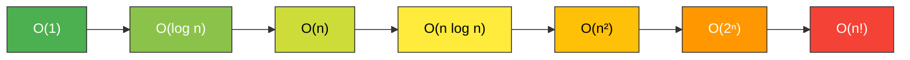

# ⏱️ Time Complexity & Big O Notation

Time complexity is a computational complexity that describes the amount of time it takes to run an algorithm. It is commonly estimated by counting the number of elementary operations performed by the algorithm, assuming that each elementary operation takes a fixed amount of time to perform.

---

## 🔍 Complexity Analysis Cases

When analyzing algorithms, we look at three different scenarios based on the input:

| Case | Notation | Description |
| :--- | :--- | :--- |
| **Best Case** | **Omega Notation ($\Omega$)** | The minimum time required for an algorithm to complete (Lower bound). |
| **Average Case** | **Theta Notation ($\Theta$)** | The expected time required for an algorithm to complete (Tight bound). |
| **Worst Case** | **Big O Notation ($O$)** | The maximum time required for an algorithm to complete (Upper bound). |

> [!IMPORTANT]
> In software engineering, we most commonly use **Big O Notation ($O$)** because we want to ensure our systems can handle the worst-case scenario efficiently.

---

## 📈 Big O Complexity Chart

The following list shows the most common time complexities from fastest (best) to slowest (worst):

1.  **$O(1)$ - Constant Time**: Execution time remains the same regardless of input size.
2.  **$O(\log n)$ - Logarithmic Time**: Execution time grows slowly as input size increases (e.g., Binary Search).
3.  **$O(n)$ - Linear Time**: Execution time grows proportionally with input size.
4.  **$O(n \log n)$ - Linearithmic Time**: Common in efficient sorting algorithms like Merge Sort and Quick Sort.
5.  **$O(n^2)$ - Quadratic Time**: Execution time grows with the square of the input size (e.g., Nested loops).
6.  **$O(2^n)$ - Exponential Time**: Execution time doubles with each addition to the input.
7.  **$O(n!)$ - Factorial Time**: The slowest growth rate, often seen in exhaustive searches (e.g., Traveling Salesperson).

### 📊 Growth Rate Comparison



---

## 💻 Code Examples & Analysis

Here are some examples based on `TimeComplexity.js`:

### 1. Linear Time - $O(n)$
Iterating through an array once.
```javascript
function printAll(arr) {
  for (let i = 0; i < arr.length; i++) {
    console.log(arr[i]);
  }
}
```

### 2. Quadratic Time - $O(n^2)$
Nested loops where both loops depend on the same input size $n$.
```javascript
function printAllPairs(arr) {
  for (let i = 0; i < arr.length; i++) {
    for (let j = 0; j < arr.length; j++) {
      console.log(arr[i], arr[j]);
    }
  }
}
```

### 3. Logarithmic Time - $O(\log n)$
Dividing the problem size in half each iteration (e.g., Binary Search).
```javascript
function binarySearch(arr, target) {
    let left = 0;
    let right = arr.length - 1;

    while (left <= right) {
        let m = Math.floor((left + right) / 2);
        if (arr[m] === target) return m;
        else if (arr[m] < target) left = m + 1;
        else right = m - 1;
    }
    return -1;
}
```

### 4. Advanced Analysis - $O(n \log^2 n)$
Complex nested loops where inner loops are logarithmic.
```javascript
// Example analysis:
for(let i = n/2; i < n; i++)        // O(n)
  for(let k = 1; k < n; k = k * 2)  // O(log n)
    for(let j = 1; j < n; j = j * 2)// O(log n)
      console.log(i + k + j);       // Total: O(n * log n * log n) = O(n log² n)
```

---

## 💡 Pro Tips
- **Drop the Constants**: $O(2n)$ becomes $O(n)$.
- **Drop Non-Dominant Terms**: $O(n^2 + n)$ becomes $O(n^2)$.
- **Space Complexity**: Don't forget that algorithms also use memory (Space Complexity), measured in the same Big O terms.

---

## 👨‍💻 Author
**Ahmed GH Tarek**  
[GitHub Profile](https://github.com/ahmedGHtarek0)
